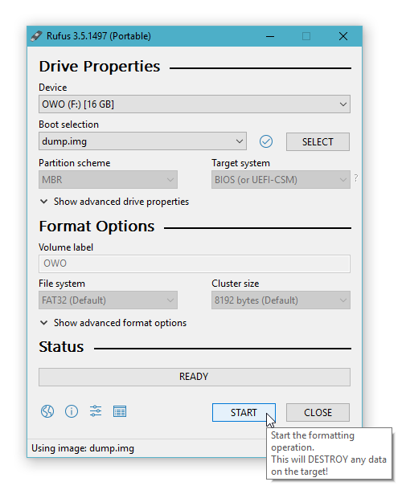

# dump
A bootable real mode program that prints initial register contents.

For what it's worth, also doubles as an example of how a simple bootable program might be achieved.

## Requirements
- [nasm](https://nasm.us), to assemble nasm-flavored 16-bit x86 assembly
- [QEMU](https://www.qemu.org), if you want to test boot in a virtual machine
- [Rufus](https://rufus.ie), if you want to boot from a real PC

## How to build
Assemble the code with nasm:
```sh
nasm -f bin src/dump.asm build/dump.bin
```
or run build.bat

## How to use

**Method 1:**
Do a test boot with QEMU
```sh
qemu-system-i386 -drive file=build/dump.bin,format=raw -monitor stdio
```
or run test.bat

**Method 2:**
1. Create a bootable USB or similar with Rufus
    
    
    
2. Reboot machine from said USB
